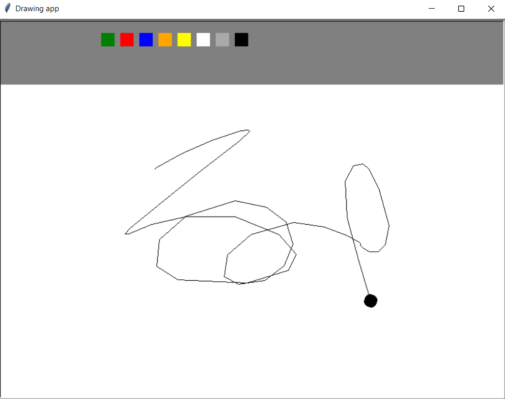

# Drawing app
This is some random bullshit I made for fun when I was bored :)

No external libraries, no frameworks, just pure built-in turtle)
I am actually suprised that it's possible to make something like this with turtle

## Preview


## Functionality
- Press any number from 1 to 5 to change size of the pen
- Press ```c``` to clear the screen
- Press ```f``` to start filling the shape, then draw the self-closing shape from where you started (ex: circle) and press ```f``` again to fill up the shape with the current color
- You can pick a color by clicking on square colors in the tools bar above
- To draw you have to double click on the cursor pen and drag it